# university-projects
Collection of (almost) all the projects that I developed for the different coursed in my Bachelors and Masters degree at Instituto Superior Técnico.

# 1st year (Bsc.)

Click to expand!

()[FP]          )[IAC]       )[LP]

  

# 2nd year (Bsc.)

  
Click to expand!

  
()[ASA]        ()[IPM]     ()[PO]
()[SO]       

# 3rd year (Bsc.) 

  
Click to expand!

  
()[BD]           ()[CG]        ()[CO]
()[ES]           ()[IA]        ()[RC] 
()[SD]

# 4th and 5th year (Msc.)

  
Click to expand!

  
()[AASMA] ()[AVT] ()[CMU]
()[CNV] ()[CRC] ()[DAD] 
()[LN] ()[SIRS]       

